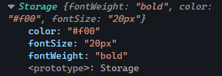

# Notes

## localStorage

**localStorage** => A property on the window allows you to access the objects storage

```javascript
console.log(window.localStorage); // localStorage info
console.log(typeof window.localStorage); // type => object
```

### Methods

#### setItem

**setItem** => Adding properties in `Key and Value` format

We can use three ways to `setItem`

```javascript
window.localStorage.setItem("key", "value");
//setting color
window.localStorage.setItem("color", "#f00");
window.localStorage.fontWeight = "bold";
window.localStorage["fontSize"] = "20px";
// key = color
// value = #f00
```

```javascript

```

you can check your code in this way

```javascript
console.log(window.localStorage); // give you the info of your localStorage
```

localStorage info on console



**getItem** => Getting the key of `setItem` to prepare it being usble

Three ways to `getItem`

```javascript
console.log(window.localStorage.getItem("color")); // key = color form setItem we wrote before
//key = color
console.log(window.localStorage.fontWeight); // object method
//key = fontWeight
console.log(window.localStorage["fontSize"]); // square pracet method
//key = fontSize
```

**Check localStorage from the browser**

_Chrome_ => inspect > application > local storage
_Mozilla_ => inspect > storage > local storage


**Display the getItem in DOM**

You can use any of this way all of them doing the same job

```javascript
document.body.style.backgroundColor = window.localStorage.getItem("color");
document.body.style.backgroundColor = window.localStorage.color;
document.body.style.backgroundColor = window.localStorage["color"];
```
